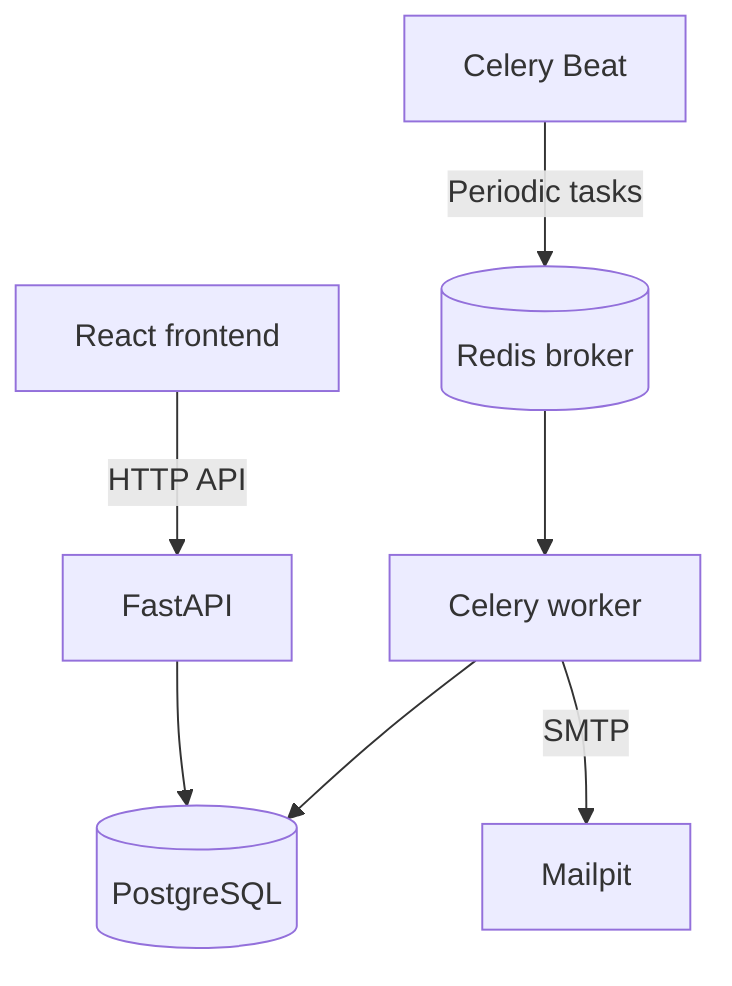

# Job Tracker

[](https://github.com/Karasikdd/job-tracker/actions/workflows/ci.yml)

A full-stack application for managing job applications, tracking status changes, and scheduling reminders with in-app notifications and optional email delivery.

Built with FastAPI, React, TypeScript, PostgreSQL, Celery, and Redis.

## Features

- User registration and JWT authentication.
- Create, edit, and delete job applications.
- Search, status filtering, and pagination.
- Application status history and statistics.
- Create, edit, and cancel scheduled reminders.
- In-app notifications with unread filtering and a shared unread counter.
- User-controlled email notification settings.
- Session restoration after a page reload while the access token remains valid.
- Local email inspection through Mailpit.

## Technology

| Area | Tools |
| --- | --- |
| Backend | Python, FastAPI, Pydantic |
| Database | PostgreSQL, SQLAlchemy, Alembic |
| Authentication | JWT, Argon2 password hashing |
| Background processing | Celery, Redis |
| Frontend | React, TypeScript, Vite |
| Local email | Mailpit |
| Testing | pytest, FastAPI TestClient |
| Automation | GitHub Actions, Docker Compose |

## Architecture



FastAPI handles authentication, application management, reminders, and notification preferences.

Celery Beat schedules reminder processing every 30 seconds and email dispatch every 15 seconds. The worker processes due reminders, creates in-app notifications, and queues email deliveries when the reminder and user settings allow email.

## Implementation Details

- Ownership checks restrict access to each user's applications and notifications.
- Reminder processing uses PostgreSQL row locks with `SKIP LOCKED`.
- Processing a reminder updates its status and creates its notification within a database transaction.
- Reprocessing an already fired reminder does not create another notification.
- Marking a notification as read preserves its original read timestamp on repeated requests.
- Reminder timestamps are timezone-aware and normalized to UTC.
- Tests use a separate database and transaction rollback for isolation.

## Local Setup

### Prerequisites

- Git
- Docker with Docker Compose
- Node.js 24 and npm
- Python 3.13 or 3.14 for running backend tests locally

### 1. Clone the repository

```bash
git clone https://github.com/Karasikdd/job-tracker.git
cd job-tracker
```

### 2. Configure the environment

Copy the example file if `.env` does not already exist:

```bash
cp .env.example .env
```

Generate a secret:

```bash
python3 -c "import secrets; print(secrets.token_hex(32))"
```

Set `SECRET_KEY` in `.env` to the generated value. Do not commit `.env`.

The example environment uses host addresses for local Python processes. Docker Compose overrides database, Redis, and SMTP addresses for containers.

### 3. Build and start the infrastructure

```bash
docker compose config --quiet
docker compose build api worker beat
docker compose up -d db redis mailpit
```

### 4. Apply database migrations

```bash
docker compose run --rm api alembic upgrade head
```

### 5. Start the backend and background processes

```bash
docker compose up -d api worker beat
docker compose ps
```

Run only one Beat instance for this schedule.

### 6. Start the frontend

```bash
cd frontend
npm ci
npm run dev
```

Use `http://127.0.0.1:5173` consistently when testing browser sessions.

### Local Services

| Service | Address |
| --- | --- |
| Frontend | http://127.0.0.1:5173 |
| API documentation | http://127.0.0.1:8000/docs |
| Mailpit inbox | http://127.0.0.1:8025 |
| PostgreSQL | 127.0.0.1:5433 |
| Test PostgreSQL | 127.0.0.1:5434 |
| Redis | 127.0.0.1:6379 |

## Try a Reminder

1. Register an account and create an application.
2. Open Settings, enable email reminders, and save.
3. Open the application and create a reminder a few minutes in the future.
4. Select “Also send email”.
5. After the scheduled time, refresh the reminder and notification lists.
6. Check Mailpit for the email.
7. Mark the notification as read and check the unread counter.

Background processing is periodic, so delivery may occur shortly after the scheduled time.

Compose enables email delivery to local Mailpit. Messages are captured there rather than delivered to external inboxes.

## Tests

Run these commands from the repository root.

### Prepare the Python environment

```bash
python3 -m venv .venv
source .venv/bin/activate
python -m pip install -r requirements.txt
```

### Start and migrate the test database

```bash
docker compose --profile test up -d testdb
```

Apply migrations using `TEST_DATABASE_URL` from `.env`:

```bash
python - <<'PY'
import os

from dotenv import load_dotenv
from sqlalchemy.engine import make_url

load_dotenv()
test_url = os.environ["TEST_DATABASE_URL"]

if make_url(test_url).database != "jobtracker_test":
    raise RuntimeError("Expected the jobtracker_test database")

os.environ["DATABASE_URL"] = test_url

from alembic import command
from alembic.config import Config

command.upgrade(Config("alembic.ini"), "head")
PY
```

### Run backend tests

```bash
python -m pytest -q
```

Tests cover application management, authentication, ownership isolation, notification settings, reminder processing, cancellation, and repeated processing.

The notification service tests check email delivery records without sending real emails.

### Check the frontend

```bash
cd frontend
npm ci
npm run lint
npm run build
```

## Continuous Integration

GitHub Actions runs on pushes and pull requests:

- Backend tests on Python 3.13 and 3.14.
- PostgreSQL database migrations before tests.
- Python dependency compatibility checks.
- Frontend lint and production build on Node.js 24.

## Useful Commands

View backend and worker logs:

```bash
docker compose logs --tail=100 api worker beat
```

Stop the containers while retaining the database volume:

```bash
docker compose down
```

## Current Limitations

- Access tokens are stored in `sessionStorage` for reload persistence. They remain accessible to JavaScript.
- Refresh-token rotation and automatic session renewal are not implemented. Users must sign in again after token expiration.
- Local email delivery uses Mailpit.
- Notifications are in-app records, not browser push notifications.
- The unread counter polls periodically; the notification list is refreshed on demand.
- The development setup does not include a public production deployment.